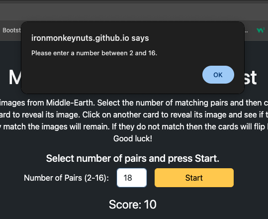
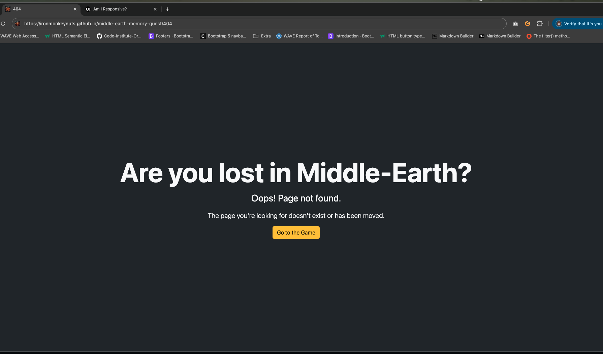

# [middle-earth-memory-quest](https://ironmonkeynuts.github.io/middle-earth-memory-quest)

This a memory game where users attempt to match pairs of images by turning over cards.

## Site Mockups

source: [middle-earth-memory-quest amiresponsive](https://ui.dev/amiresponsive?url=https://ironmonkeynuts.github.io/middle-earth-memory-quest)

## UX

### The 5 Planes of UX

#### 1. Strategy Plane
##### Purpose
- Provide users with a interactive matching image game
- Deliver instant feedback to improve usability and encourage learning.
- Support accessibility and user-friendly interactions.

##### Primary User Needs
- 

##### Business Goals
- Encourage users to engage with the app for recreational purposes.
- Showcase a well-designed, accessible tool that demonstates good interactive experience with links to related sites.

#### 2. Scope Plane
##### Features
- A full list of [Features](#features) can be viewed in detail below.

##### Content Requirements
- Clear labels and instructions for selection and game play.
- Error messages for invalid inputs or selections.
- Instant feedback on success and failure.
- Statistics display for tracking attempts, score and high score.

#### 3. Structure Plane
##### Information Architecture
- **Navigation Menu**:
  - Simple navbar with accessible links.
- **Hierarchy**:
  - Clear and prominent placement of the input fields and start/restart button.
  - Visible results area and error messages.

##### User Flow
1. User lands on the home page → reads brief instructions.
2. User selects number of pairs.
3. User clicks start button → game commences
4. User selects two cards to reveal images.
5. Views correct/incorrect matching feedback → if correct card images remain visible else card images revert to hidden.
6. User loops through events 4 and 5 until all card images are matched. 
7. Views score for completing matching game
7. Starts fresh with the next game returning to event 2.

#### 4. Skeleton Plane
##### Wireframe Suggestions
- A full list of [Wireframes](#wireframes) can be viewed in detail below.

#### 5. Surface Plane
##### Visual Design Elements
- **[Colours](#colour-scheme)**: see below.
- **[Typography](#typography)**: see below.

### Colour Scheme

I used [coolors.co](https://coolors.co/080708-3772ff-df2935-fdca40-e6e8e6) to generate my color palette.

- `#000000` primary text.
- `#3772FF` primary highlights.
- `#DF2935` secondary text.
- `#FDCA40` secondary highlights.

### Typography

- [Montserrat](https://fonts.google.com/specimen/Montserrat) was used for the primary headers and titles.
- [Lato](https://fonts.google.com/specimen/Lato) was used for all other secondary text.
- [Font Awesome](https://fontawesome.com) icons were used throughout the site, such as the social media icons in the footer.

## User Stories

| Target | Expectation | Outcome |
| --- | --- | --- |
| As a user | I would like to select number of pairs and a start button | so that I can set the game to my preffered level and start it.|
| As a user | I would like to select two cards, reveal their images | so that I can see if they match or memorise card images for later selection.|
| As a user | I would like the application to show me an error message if I enter an empty input (`NaN`) or an input outside the accepted parameters| so that I understand what went wrong. |
| As a user | I would like the game to acknowledge if two cards match or are different | so that results of selection are highlighted. |
| As a user | I would like the application to have clear and large buttons and selectable cards | so that I can easily select the correct one on any device. |
| As a user | I would like the application to have high-contrast colors and accessible fonts | so that I can easily read and interact with it. |
| As a user | I would like clear labels and instructions | so that I understand how to use the app without confusion. |
| As a user | I would like to see the score I make to complete the puzzle | so I can push myself to improve my performance. |
| As a user | I would like to see a 404 error page if I get lost | so that it's obvious that I've stumbled upon a page that doesn't exist. |

## Wireframes

To follow best practice, wireframes were developed for mobile, tablet, and desktop sizes.
I've used [Balsamiq](https://balsamiq.com/wireframes) to design my site wireframes.

| Page | Mobile | Tablet | Desktop |
| --- | --- | --- | --- |
| Home |  |  |  |
| 404 |  |  |  |

## Features

### Existing Features

| Feature | Notes | Screenshot |
| --- | --- | --- |
| Number of pairs| This input controls the difficulty level by changing the number of matching pairs of images in a particular game. |  |
| Start  | This button allows user to start or restart the game. |  |
| Score | This display current score based on attempts increasing score for matching pairs and decreasing scores for unmatching pairs. |  |
| Invalid entry alert | When a user inputs a number less than 2 or greater than 16 into the Number of pairs input, an alert is used to provide simple feedback. |   |
| Game completed alert | When a user completes a game, an alert is used to provide simple feedback to the user. |  |
| 404 | The 404 error page will indicate when a user has somehow navigated to a page that doesn't exist. This replaces the default GitHub Pages 404 page, and ties-in with the look and feel of the *Middle-Earth Memory Quest* site by using the same styling and appearance. |  |

### Future Features

- **High Score**: Provide a display of the current high score.
- **Dark Mode**: Add a dark mode/ light mode toggle option to enhance user experience and reduce eye strain during extended use.
- **Customizable Themes**: Allow users to choose different themes, colors, images or layouts for personalizing their experience.
- **Save & Share**: Allow users to save or share their results via a link or social media, especially for complex equations or useful outputs.
- **Voice Input**: Add a voice input option for users to dictate their choices instead of typing.

## Tools & Technologies

| Tool / Tech | Use |
| --- | --- |
|  | Generate README and TESTING templates. |
|  | Version control. (`git add`, `git commit`, `git push`) |
|  | Secure online code storage. |
|  | Cloud-based IDE for development. |
|  | Local IDE for development. |
|  | Main site content and layout. |
|  | Design and layout. |
|  | User interaction on the site. |
|  | Hosting the deployed front-end site. |
|  | Front-end CSS framework for modern responsiveness and pre-built components. |
|  | Automated JavaScript testing. |
|  | Creating wireframes. |
|  | Icons. |
|  | Help debug, troubleshoot, and explain things. |

## Testing

> [!NOTE]
> For all testing, please refer to the [TESTING.md](TESTING.md) file.

## Deployment

### GitHub Pages

The site was deployed to GitHub Pages. The steps to deploy are as follows:

- In the [GitHub repository](https://www.github.com/Ironmonkeynuts/middle-earth-memory-quest), navigate to the "Settings" tab.
- In Settings, click on the "Pages" link from the menu on the left.
- From the "Build and deployment" section, click the drop-down called "Branch", and select the **main** branch, then click "Save".
- The page will be automatically refreshed with a detailed message display to indicate the successful deployment.
- Allow up to 5 minutes for the site to fully deploy.

The live link can be found on [GitHub Pages](https://ironmonkeynuts.github.io/middle-earth-memory-quest).

### Local Development

This project can be cloned or forked in order to make a local copy on your own system.

#### Cloning

You can clone the repository by following these steps:

1. Go to the [GitHub repository](https://www.github.com/Ironmonkeynuts/middle-earth-memory-quest).
2. Locate and click on the green "Code" button at the very top, above the commits and files.
3. Select whether you prefer to clone using "HTTPS", "SSH", or "GitHub CLI", and click the "copy" button to copy the URL to your clipboard.
4. Open "Git Bash" or "Terminal".
5. Change the current working directory to the location where you want the cloned directory.
6. In your IDE Terminal, type the following command to clone the repository:
	- `git clone https://www.github.com/Ironmonkeynuts/middle-earth-memory-quest.git`
7. Press "Enter" to create your local clone.

Alternatively, if using Gitpod, you can click below to create your own workspace using this repository.

**Please Note**: in order to directly open the project in Gitpod, you should have the browser extension installed. A tutorial on how to do that can be found [here](https://www.gitpod.io/docs/configure/user-settings/browser-extension).

#### Forking

By forking the GitHub Repository, you make a copy of the original repository on our GitHub account to view and/or make changes without affecting the original owner's repository. You can fork this repository by using the following steps:

1. Log in to GitHub and locate the [GitHub Repository](https://www.github.com/Ironmonkeynuts/middle-earth-memory-quest).
2. At the top of the Repository, just below the "Settings" button on the menu, locate and click the "Fork" Button.
3. Once clicked, you should now have a copy of the original repository in your own GitHub account!

### Local VS Deployment

There are no remaining major differences between the local version when compared to the deployed version online.

## Credits

### Content

| Source | Notes |
| --- | --- |
| [Markdown Builder](https://markdown.2bn.dev) | Help generating Markdown files |
| [Chris Beams](https://chris.beams.io/posts/git-commit) | "How to Write a Git Commit Message" |
| [Interactive Frontend Development](https://codeinstitute.net) | Code Institute walkthrough project inspiration |
| [Bootstrap](https://getbootstrap.com) | Various components / responsive front-end framework |
| [Open AI ChatGPT](https://openai.com/index/chatgpt/) | Help with code logic and explanations |

### Media

| Source | Notes |
| --- | --- |
| [favicon.io](https://favicon.io) | Generating the favicon |
| [Font Awesome](https://fontawesome.com) | Icons used throughout the site |
| [Open AI Chat GPT](https://openai.com/index/chatgpt/) | AI generated artwork |

### Acknowledgements

- I would like to thank my Code Institute mentor, [Tim Nelson](https://www.github.com/TravelTimN) for the support throughout the development of this project.
- I would like to thank my Runshaw College tutor, [Thomas Cowan](cowen.t@runshaw.ac.uk) for the support throughout the development of this project.
- I would like to thank my  class mates on the Runshaw College L5 Web Application Course, for their input and support throughout the development of this project.
- I would like to thank the [Code Institute](https://codeinstitute.net) Tutor Team for their assistance with troubleshooting and debugging some project issues.
- I would like to thank the [Code Institute Slack community](https://code-institute-room.slack.com) for the moral support; it kept me going during periods of self doubt and impostor syndrome.

