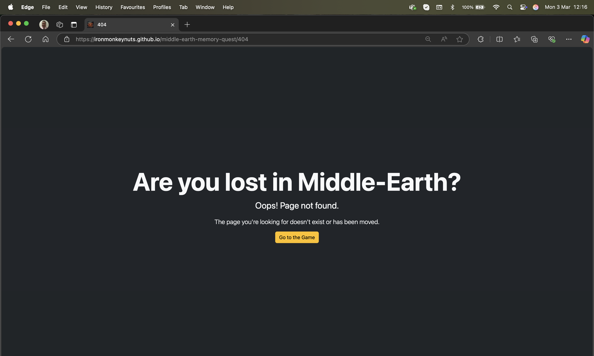

# Testing

> [!NOTE]
> Return back to the [README.md](README.md) file.

## Code Validation

### HTML

I have used the recommended [HTML W3C Validator](https://validator.w3.org) to validate all of my HTML files.

| Directory | File | URL | Screenshot | Notes |
| --- | --- | --- | --- | --- |
|  | [index.html](https://ironmonkeynuts.github.io/middle-earth-memory-quest/index.html) | [HTML Validator](https://validator.w3.org/nu/?doc=https%3A%2F%2Fironmonkeynuts.github.io%2Fmiddle-earth-memory-quest%2Findex.html) |  | No errors or warnings. |
|  | [404.html](https://ironmonkeynuts.github.io/middle-earth-memory-quest/404.html) | [HTML Validator](https://validator.w3.org/nu/?doc=https%3A%2F%2Fironmonkeynuts.github.io%2Fmiddle-earth-memory-quest%2F404.html) |  | No errors or warnings. |

### CSS

I have used the recommended [CSS Jigsaw Validator](https://jigsaw.w3.org/css-validator) to validate all of my CSS files.

| Directory | File | URL | Screenshot | Notes |
| --- | --- | --- | --- | --- |
| assets/css | [style.css](https://ironmonkeynuts.github.io/middle-earth-memory-quest/assets/css/style.css) | [CSS Validator](https://jigsaw.w3.org/css-validator/validator?uri=https%3A%2F%2Fironmonkeynuts.github.io%2Fmiddle-earth-memory-quest%2Fassets%2Fcss%2Fstyle.css&profile=css3svg&usermedium=all&warning=1&vextwarning=&lang=en) |  | No errors. |

### JavaScript

I have used the recommended [JShint Validator](https://jshint.com) to validate all of my JS files.

| Directory | File | URL | Screenshot | Notes |
| --- | --- | --- | --- | --- |
| assets/js | [game.js](https://ironmonkeynuts.github.io/middle-earth-memory-quest/assets/js/game.js) | N/A |  | Notes (if applicable) |

## Responsiveness

I've tested my deployed project to check for responsiveness issues.

| Page | Mobile | Tablet | Desktop | Notes |
| --- | --- | --- | --- | --- |
| Home |  |  |  | Works as expected | |
| 404 |  |  |  | Works as expected |

## Browser Compatibility

I've tested my deployed project on multiple browsers to check for compatibility issues.

| Page | Chrome | Edge | Safari | Notes |
| --- | --- | --- | --- | --- |
| Home |  |  |  | Works as expected |
| 404 |  |  |  | Works as expected |

## Lighthouse Audit

I've tested my deployed project using the Lighthouse Audit tool to check for any major issues. Some warnings are outside of my control, and mobile results tend to be lower than desktop.

| Page | Mobile | Desktop |
| --- | --- | --- |
| Home |  |  |
| 404 |  |  |

## Defensive Programming

Defensive programming was manually tested with the below user acceptance testing:

| Page/Feature | Expectation | Test | Result | Screenshot |
| --- | --- | --- | --- | --- |
| Number of pairs| Feature is expected to allow the user to enter a number from 2 to 16 and then select Start Game | Entered a number and selected each Start game button to coommence game. | Game commenced as expected. |  |
| Invalid inputs | Feature is expected to show an error message if inputs are outside expected prameters. | Tried starting game with invalid number in input field. | Error message displayed as expected. |  |
| Start button | Feature is expected to display button that is clear, large, and easy to select on all devices. | Verified button size and usability across multiple devices (mobile, tablet, desktop). | Button was accessible and easy to use on all tested devices. |  |
| Game board | Feature is expected to display a clear grid of 2 to 16 pairs of cards shuffled randomly. | Verified grid display and card size and clarity. | Grid displayed coreectly and cards were accessible and easy to select. |  |
| Accessibility | Feature is expected to use high-contrast colors and accessible fonts. | Checked contrast ratios using accessibility tools (e.g., Lighthouse, Wave). | Colors and fonts met accessibility standards. |  |
| Instructions | Feature is expected to have clear labels and instructions for user guidance. | Reviewed labels and instructions for clarity and ease of use. | Labels and instructions were clear and intuitive. |  |
| Score Tracker | Feature is expected to track the number of correct and incorrect pair matches. | Performed multiple pair selections (correct and incorrect) and checked the score tracker. | Score tracker updated correctly for all tested scenarios. |  |
| 404 Error Page | Feature is expected to display a 404 error page for non-existent pages. | Navigated to an invalid URL (e.g., `/test`) to test error handling. | A custom 404 error page was displayed as expected. |  |

## User Story Testing

| Target | Expectation | Outcome | Screenshot |
| --- | --- | --- | --- |
| As a user | I would like to select number of pairs and a start button | so that I can set the game to my preffered level and start it. |  |
| As a user | I would like to select two cards, reveal their images | so that I can see if they match or memorise card images for later selection. |  |
| As a user | I would like the application to show me an error message if I enter an empty input (`NaN`) or an input outside the accepted parameters  | so that I understand what went wrong. |   |
| As a user | I would like the game to acknowledge if two cards match or are different | so that results of selection are highlighted. |  |
| As a user | I would like the application to have clear and large buttons and selectable cards | so that I can easily select the correct one on any device. |  |
| As a user | I would like the application to have high-contrast colors and accessible fonts | so that I can easily read and interact with it. |  |
| As a user | I would like clear labels and instructions | so that I understand how to use the app without confusion. |  |
| As a user | I would like to see the score I make to complete the puzzle | so I can push myself to improve my performance. |  |
| As a user | I would like to see a 404 error page if I get lost | so that it's obvious that I've stumbled upon a page that doesn't exist. |  |

## Automated Testing

I have conducted a series of automated tests on my application.

> [!NOTE]
> I fully acknowledge and understand that, in a real-world scenario, an extensive set of additional tests would be more comprehensive.

### JavaScript (Jest Testing)

I have used the [Jest](https://jestjs.io) JavaScript testing framework to test the application functionality. In order to work with Jest, I first had to initialize NPM.

Below are the results from the tests that I've written for this application:

| Test Suites | Tests | Screenshot |
| --- | --- | --- |
| 01 failed | 02 failed |  |

#### Jest Test Issues

## Bugs

### Fixed Bugs

I've used [GitHub Issues](https://www.github.com/Ironmonkeynuts/middle-earth-memory-quest/issues) to track and manage bugs and issues during the development stages of my project.

All previously closed/fixed bugs can be tracked [here](https://www.github.com/Ironmonkeynuts/middle-earth-memory-quest/issues?q=is%3Aissue+is%3Aclosed+label%3Abug).

### Unfixed Bugs

Any remaining open issues can be tracked [here](https://www.github.com/Ironmonkeynuts/middle-earth-memory-quest/issues).

### Known Issues

| Issue |
| --- | --- |
| On devices smaller than 375px, the page starts to have horizontal `overflow-x` scrolling. |

> [!IMPORTANT]
> There are no remaining bugs that I am aware of, though, even after thorough testing, I cannot rule out the possibility.

